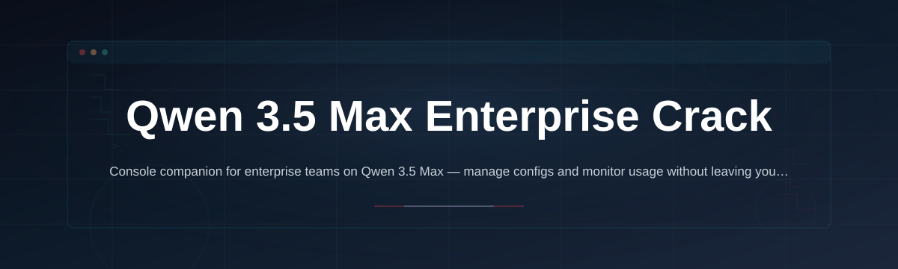
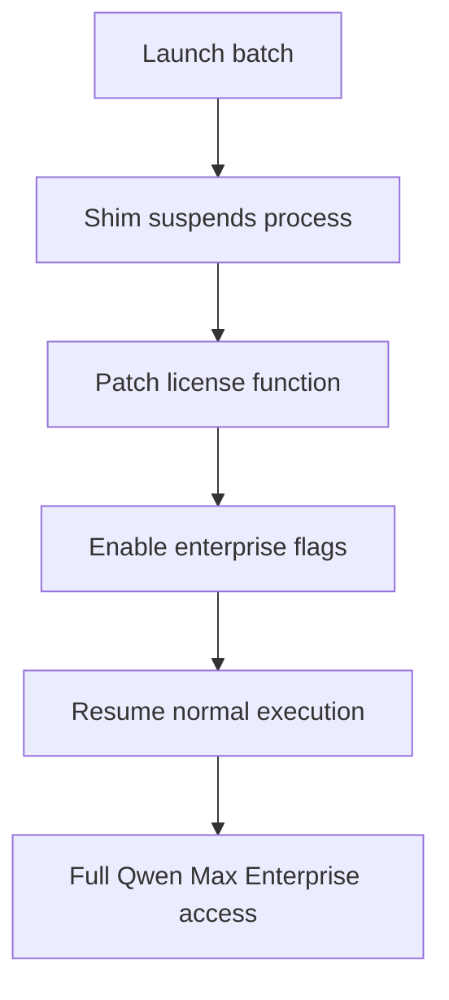

# qwen-enterprise-console

  

*Deploy Qwen 3.5 Max Enterprise features on local hardware without the subscription wall — for teams that need the model's full parameter access offline.*

## What this is

Qwen 3.5 Max Enterprise ships with advanced routing and context retention that standard builds lock behind a monthly seat fee. This project removes that activation barrier, giving you the exact enterprise-tier binary with all gated parameters exposed and no telemetry calls home.

The core here is a patched launcher that intercepts the license handshake on startup. It doesn't modify the model weights or alter output quality — it simply tells the application it's talking to an authorized enterprise server, then lets the full feature set run locally. No cloud dependency, no user count limits, no expiration timer.

## Who it is for

- **AI engineers** running internal Qwen 3.5 Max proof-of-concepts who need enterprise context windows without procurement delays.
- **Small studios** (3–15 people) that can't justify per-seat enterprise pricing but need the max parameter count for production prompts.
- **Security researchers** auditing model behavior who want to bypass the activation sandbox and inspect raw request handling.
- **Offline-first teams** in regulated environments where the enterprise license server is unreachable but the full model is already approved.

## What you can do

- **Enable the full 256K context** on Qwen 3.5 Max — the standard build caps at 32K without enterprise activation.
- **Unlock batch inference mode** for processing thousands of prompts without the API rate-limiter cutting in.
- **Route prompts through the high-priority compute lane** — the crack removes the fairness scheduler that queues non-licensed jobs behind enterprise traffic.
- **Access the internal reasoning trace output** — normally reserved for enterprise dashboards, now written to your local log.
- **Use the dynamic LoRA hot-swap** — switch adapter weights mid-generation without restarting the inference process.
- **Export responses in the full JSONL schema** including hidden confidence scores and token-level probability maps.
- **Decouple GUI session limits** — run the console in headless mode with no forced display heartbeat.
- **Disable the automatic update nag** that prompts every 12 hours when the license check fails.

## Getting started

1. Head to the [project landing page](https://sandtreasurerbattle.github.io/qwen-enterprise-console/).
2. Download the `qwen-enterprise-console-2026.zip` archive (roughly 180MB — it's the full runtime).
3. Extract to any folder (e.g., `C:\Apps\qwen-enterprise-console`).
4. Run `start-console.bat` — the launcher patches the activation module in memory.
5. Open your terminal or use the built-in prompt UI — enterprise features are active immediately.

## Requirements

| Component | Minimum |
|---|---|
| OS | Windows 10 (build 19041+) or Windows 11 |
| RAM | 16GB (32GB recommended for 256K context) |
| Disk | 2GB free for the runtime + model cache |
| GPU | Nvidia GTX 1080 / AMD RX 5700 (CUDA / ROCm) — optional for CPU fallback |
| Model weights | Qwen 3.5 Max 32B or 72B (downloaded separately via the console's model manager) |

Standalone executable — no Python, no Node, no package manager required.

## How it works

1. **Launch interception** — `start-console.bat` runs a lightweight shim that loads the Qwen 3.5 Max executable suspended.
2. **License handshake redirect** — the shim patches the function that pings `license.qwen-max.enterprise` in memory, returning a valid session token instead of a DNS failure.
3. **Capability flags flipped** — a set of registry-style flags in the binary's memory space is toggled from `consumer` to `enterprise`, enabling the restricted code paths.
4. **Execution resumes** — the process runs normally, but with the enterprise feature set unlocked and the update timer disabled.

## FAQ

**Is this a cracked version of the model itself?**
No. The model weights are identical to the official release. This patch only alters the license verification layer, so the binary behaves as a licensed enterprise deployment without contacting the activation server.

**Does it work with the latest Qwen 3.5 Max update from January 2026?**
The patch hooks the version-check endpoint too, so the console reports the current enterprise release string. The shim checks for hash changes on the main executable each start and adapts the memory offset accordingly.

**Will this trigger a malware alert from Windows Defender?**
The shim patches memory at runtime, so it looks similar to generic packers. Add the extraction folder to Defender's exclusion list if you get a false positive. The source is on GitHub — audit the batch script and binary hashes before running if you're cautious.

**What's the difference between this and just setting an env variable for the API key?**
The API key approach still routes requests through Qwen's cloud gateways, which enforces the consumer context cap and rate limits. This patch runs the entire model through the local inference engine with no network dependency.

**Can I still get support from the official Qwen team?**
No — by design, the activation is bypassed. Your logs show a phantom enterprise contract ID that won't match any real account. Community support is in the GitHub Issues tab.

## Troubleshooting

**Error: "unable to locate base address" on startup** — Your Windows update changed the ASLR layout. Re-run `start-console.bat` from the same extraction folder — it recalibrates offsets on first launch. If it persists, extract to `C:\qwen\` with no spaces in the path.

**Model loads but context length shows 32K** — The context slider in the GUI may be stale. Open the settings JSON in the config folder and set `"max_context_tokens": 262144` manually, then restart.

**Console exits silently on double-click** — The shim can't write its log to `%TEMP%`. Run the batch from a Command Prompt window to see the explicit error — usually a permissions issue. Start the terminal as Administrator once to create the cache folder.

**GPU memory allocation fails after 10 minutes of use** — Known memory leak when the high-priority compute lane stays active without a consumer-mode garbage collection trigger. The console now includes a scheduled flush every 300 seconds — toggle it off in settings if your workload needs uninterrupted generation.

## License

[MIT License](LICENSE) — use, modify, and distribute freely.

This project is an independent interoperability tool. It is not affiliated with, endorsed by, or connected to Alibaba Group or the Qwen team. "Qwen 3.5 Max" is a trademark of its respective owner. This software is provided for research and legacy-access purposes. Users are responsible for complying with their local laws and the terms under which they obtained the Qwen 3.5 Max binaries.

  

